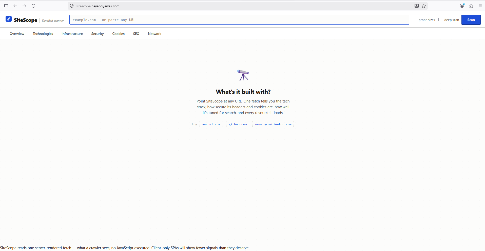
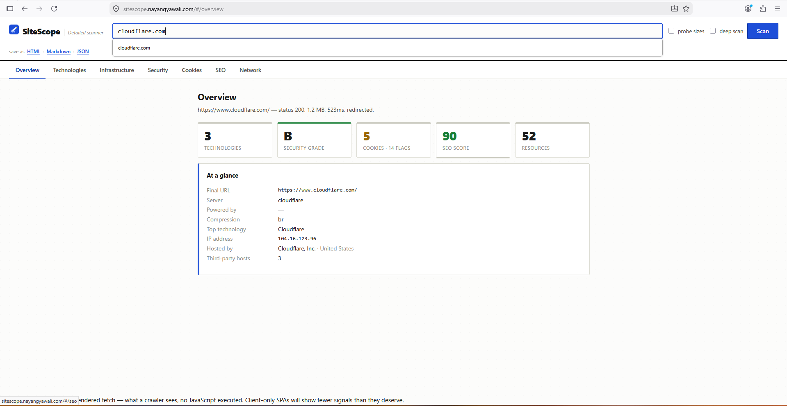
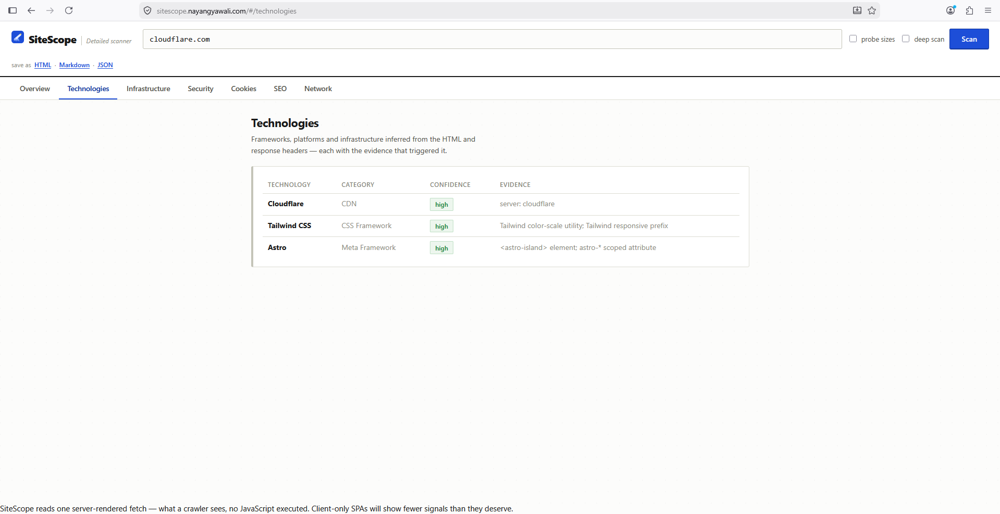
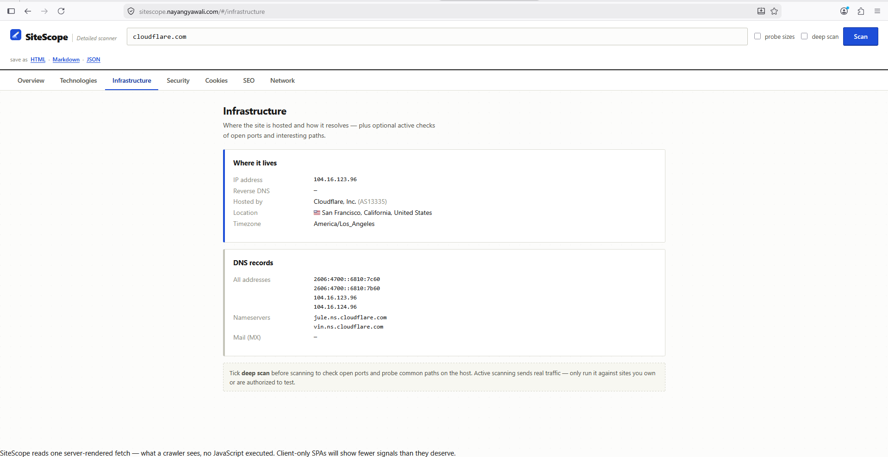
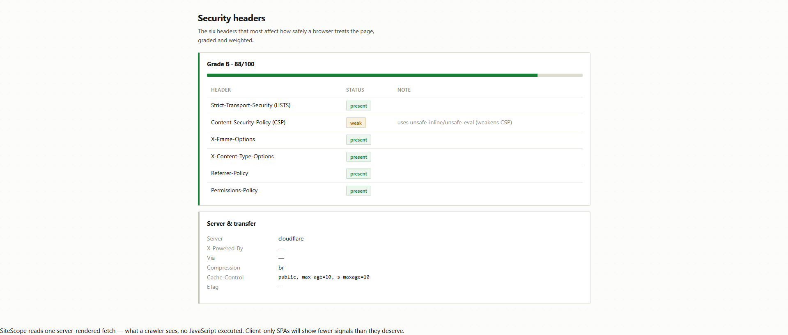

# SiteScope

Point it at any website and it tells you what the site is built with, how locked-down its headers and cookies are, how well it's set up for search, and every resource the page pulls in. One fetch, one report you can hand to someone else.

No dependencies, just Node.js 18 or newer. Runs pretty much anywhere.

```
sitescope vercel.com
```

```
SiteScope report — https://vercel.com/
status 200 · 519972 bytes · 236ms

Technologies
  Tailwind CSS       CSS Framework    high   (Tailwind color-scale utility)
  Vercel             Hosting          high   (server: Vercel)
  React              JS Framework     medium (implied by Next.js)
  Next.js            Meta Framework   high   (/_next/static/ asset path)

Security headers  ■ C (73/100)
  ✔ Strict-Transport-Security (HSTS)
  ▲ Content-Security-Policy (CSP) — uses unsafe-inline/unsafe-eval
  ✘ Permissions-Policy — header not set
  ...
```

## What you get

**Overall health score.** Every graded module — security, SEO, cookies, performance, crawlability — gets rolled into a single weighted 0–100 score with an A–F grade. There's also a "top issues" list that pulls the worst offenders from across all of them so you don't have to read the whole thing.

**Framework detection.** This is the big one. SiteScope recognizes:

- JS frameworks: React, Vue, Angular, Svelte, Preact, Alpine, HTMX, Qwik, jQuery
- Meta-frameworks: Next.js, Nuxt, Gatsby, Remix, SvelteKit, Astro
- CMS / platforms: WordPress, Ghost, Drupal, Joomla, Shopify, Magento, BigCommerce, Wix, Webflow, Squarespace
- Everything else: build tools (Vite/webpack), CSS frameworks (Tailwind/Bootstrap), analytics (GA4, GTM), Sentry, Stripe, bot protection (Turnstile/hCaptcha/reCAPTCHA), CDNs (jsDelivr/unpkg/cdnjs), and server/hosting (Cloudflare, Vercel, Netlify, Nginx, Express…)

It'll also guess the backend runtime from session-cookie names — Laravel, Django, Express, ASP.NET, JSP, PHP. Each match comes with a confidence level, the evidence that triggered it, and a version number when one happens to be visible in a filename, CDN url, or generator meta tag.

**Header analysis.** Grades the six headers that matter most (HSTS, CSP, X-Frame-Options, X-Content-Type-Options, Referrer-Policy, Permissions-Policy) into an A–F score, calls out weak configs like an `unsafe-inline` CSP, and surfaces the server/compression/caching headers too.

**Cookie audit.** Reads every `Set-Cookie` and flags the missing `Secure` / `HttpOnly` / `SameSite` attributes, invalid `SameSite=None`, and cookies scoped too broadly. Values are masked so you can paste the report somewhere.

**SEO audit.** Title, meta description (with length checks), canonical, robots, viewport, `lang`, Open Graph + Twitter cards, heading structure, images missing `alt`, internal vs external link counts. Scored out of 100.

**Crawlability.** Grabs `robots.txt` and whatever sitemap(s) it declares (following one level into a sitemap index), checks whether the page you scanned is actually allowed to be crawled, and flags a missing or empty sitemap or a site-wide disallow.

**Performance budget.** Rule-of-thumb budgets built from the resource map — request count, script/stylesheet count, third-party host count, render-blocking `<head>` scripts. Add `--probe` and you get real byte-weight budgets (total/JS/image) on top. No headless browser needed.

**Network map.** Pulls out every sub-resource (scripts, styles, images, fonts, preloads, icons), splits first- vs third-party, and groups them by host and type. `--probe` fires HEAD requests for the real sizes and status codes.

**Infrastructure.** Resolves the host to its IP address(es), does a reverse DNS lookup, and — through a free geo/ASN service — figures out who hosts it and where (org, ASN, city/country), plus NS and MX records. On by default; `--no-geo` skips the outbound call.

**Deep scan (opt-in).** `--scan-ports` does a TCP-connect check against a curated list of common service ports and flags databases or RDP left open to the internet. `--scan-paths` probes common/interesting paths — robots, sitemaps, admin panels, and dotfiles like `.git` and `.env` that really shouldn't be reachable. This one sends real traffic, see the note below.

**Vulnerability check.** Part of the deep scan (`--recon`, or the UI's deep-scan checkbox) — it runs alongside the port/path probes and sends nothing new itself. It flags outdated libraries whose version we can actually read (jQuery, Bootstrap) against known issues, calls out the services or sensitive files the scan found exposed, and points out version banners that make you easy to fingerprint. Findings come ranked worst-first with a severity, a one-line why, and a fix. It's a heads-up, not nmap and not a real audit — don't treat an empty result as an all-clear.

**Reports.** Terminal (colorized), JSON (pipe it to `jq`), Markdown (drop into a PR or doc), or a self-contained HTML dashboard.

> **Heads up: deep scan sends real traffic to the target.** `--scan-ports`, `--scan-paths`, and the UI's **deep scan** checkbox open connections and issue requests to the host. Only point them at systems you own or have permission to test. The lists are small and hand-picked on purpose — this isn't a brute-force scanner.

## The web UI

If you'd rather stay in a browser, there's a local dashboard. Start it with:

```bash
npm run ui        # or: node bin/sitescope-ui.js
```

That opens `http://127.0.0.1:4986`. Type a URL, hit **Scan**, and click through the tabs. Toggle **probe sizes** for real resource sizes, and grab the report as HTML, Markdown, or JSON from the links up top. Recent scans stick around in the URL field. Options: `--port <n>`, `--no-open`. The server only ever binds to localhost.

An empty scan lands you here:



The overview tab is the tl;dr — score cards up top, the important facts underneath:



Technologies shows every match with the evidence that gave it away:



Infrastructure covers where the site lives and how it resolves:



And the security tab grades those six headers:



## Install / run

Nothing to install — clone it and run with Node 18+:

```bash
node bin/sitescope.js <url>
```

Or link it so `sitescope` works from anywhere:

```bash
npm link          # then:
sitescope <url>
```

## Usage

```
sitescope <url> [options]

Options:
  --format <fmt>        terminal | json | markdown | html   (default: terminal)
  -o, --output <file>   write the report to a file
  --probe               HEAD-request linked resources for real sizes & status
  --scan-ports          check common service ports on the host (active scan)
  --scan-paths          probe common/interesting paths on the host (active scan)
  --recon               shorthand for --scan-ports --scan-paths
  --no-geo              skip the IP geolocation / hosting lookup
  --timeout <ms>        request timeout in milliseconds       (default: 15000)
  --user-agent <ua>     override the User-Agent header
  --no-color            disable colored terminal output
  -h, --help            show this help
```

### Examples

```bash
# Quick look in the terminal
sitescope example.com

# Markdown report for a PR
sitescope https://vercel.com --format markdown -o report.md

# Shareable HTML dashboard, with real resource sizes
sitescope github.com --format html -o report.html --probe

# Full infrastructure + deep scan of a host you control
sitescope your-own-server.com --recon

# Pull a single field with jq
sitescope news.ycombinator.com --format json | jq '.frameworks[].name'
```

## How it works

SiteScope makes one GET request for the page HTML, then runs every analyzer over that same response. That keeps it fast and keeps it polite — one hit, not fifty. Framework detection works off HTML signatures plus response headers; the network map is parsed straight from the markup (pass `--probe` if you want the real sizes fetched).

Because everything hangs off that single server-rendered fetch, it sees what a crawler sees. It doesn't run JavaScript, so a client-only SPA that renders nothing in its initial HTML is going to show fewer signals than it deserves. A headless-browser mode is on the list.

## Project layout

```
bin/sitescope.js          CLI entry + arg parsing
src/index.js              orchestrator → builds the report object
src/fetcher.js            single fetch, redirects, timing, cookies
src/detectors/frameworks.js   technology signatures
src/analyzers/headers.js      security-header grading
src/analyzers/cookies.js      Set-Cookie parsing + flags
src/analyzers/seo.js          on-page SEO checks
src/analyzers/network.js      resource extraction + optional probing
src/analyzers/crawl.js        robots.txt + sitemap.xml checks
src/analyzers/performance.js  static performance budget
src/analyzers/vulnscan.js     passive vulnerability findings
src/analyzers/score.js        overall health score rollup
src/report.js             terminal / markdown / html renderers
```

## Roadmap

- Headless-browser mode (Playwright) for SPA rendering + a real request waterfall
- Compare two URLs, or track one over time

## License

MIT
